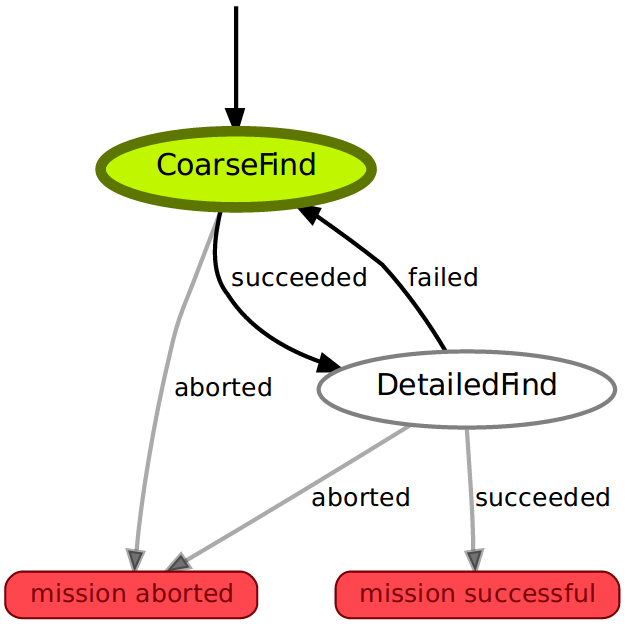

# qtcopter

## Files

    build/              ROS build directory (not committed to Git repository)
    devel/              ROS devel directory (not committed to Git repository)
    src/                ROS sources
        qtcopter        Mission nodes & launchfiles for real missions; implementation
        qtcopter_sim    Mission nodes & launchfiles for simulation
    ssh/                SSH keys to access the private Github repo
    bootstrap.sh        Install/update required software on an Ubuntu 14.04 system
    update_qtcopter.sh  Update script for non-Vagrant VMs - do not execute!
    export_vm.sh        Export a VM for non-developers
    Vagrantfile         Configuration for Vagrant

## For Developers

If you are already running Ubuntu 14.04 (Trusty), you can execute `bootstrap.sh` to set everything up for you.

To use an Ubuntu on a virtual machine, install [Vagrant][vagrant] and run `vagrant up` in this directory. The first time, this will install and set up ROS. To stop the machine, run `vagrant halt`.

To run the tests in `src/qtcopter/test` (within the VM):

```
$ cd ~/catkin_ws
$ catkin_make run_tests
```

To export the VM for non-developers:

```
$ ./export_vm.sh
```

### State Machine Introspection



Unfortunately, the SMACH (State MACHine) package's GUI tools are broken in ROS Indigo, but you can apply a patch to fix it:

```
$ sudo patch -d /opt/ros/indigo -p1 < ./smach_viewer.patch
```

To run the state machine viewer (example for the balldrop mission):

```
$ roslaunch qtcopter_sim balldrop.launch
$ rosrun smach_viewer smach_viewer.py
```

## For Users

Obtain a VM image from the developers and start it in [VirtualBox][virtualbox]. Username and password are both `vagrant`. Each time you want to update the Qtcopter code, run `update_qtcopter.sh` from the Desktop.

[vagrant]: https://www.vagrantup.com/
[virtualbox]: https://www.virtualbox.org/
